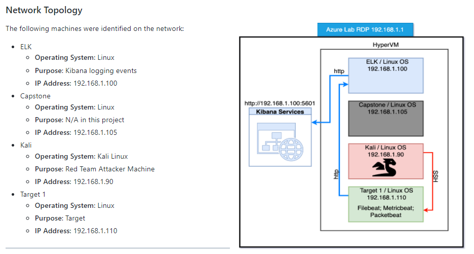

# Red-Vs-Blue-Project-2: Attack, Defense & Analysis of a Vulnerable Network
This project utilized Remote Desktop Protocol to access a pre-built VM which contained more VMs within its Hyper-V Manager.

